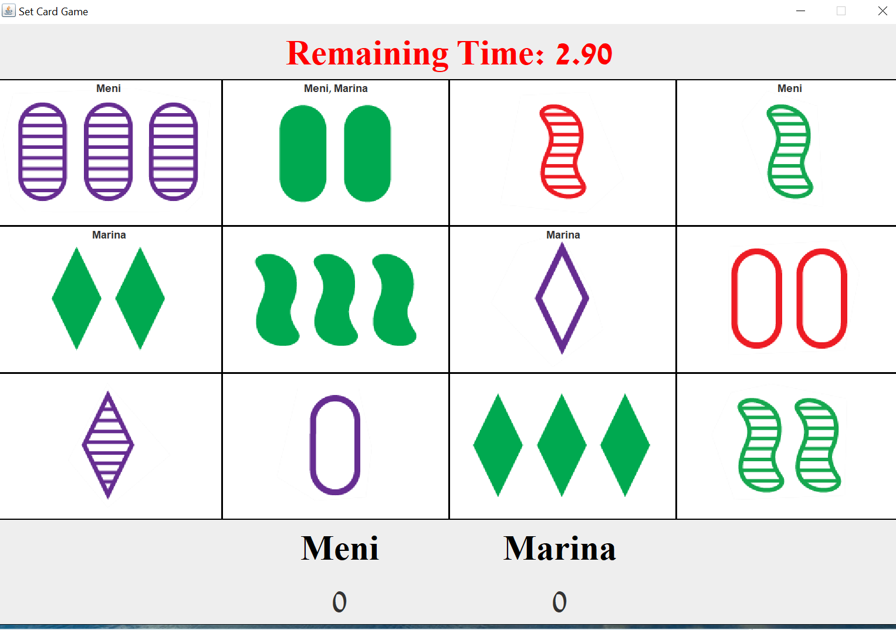
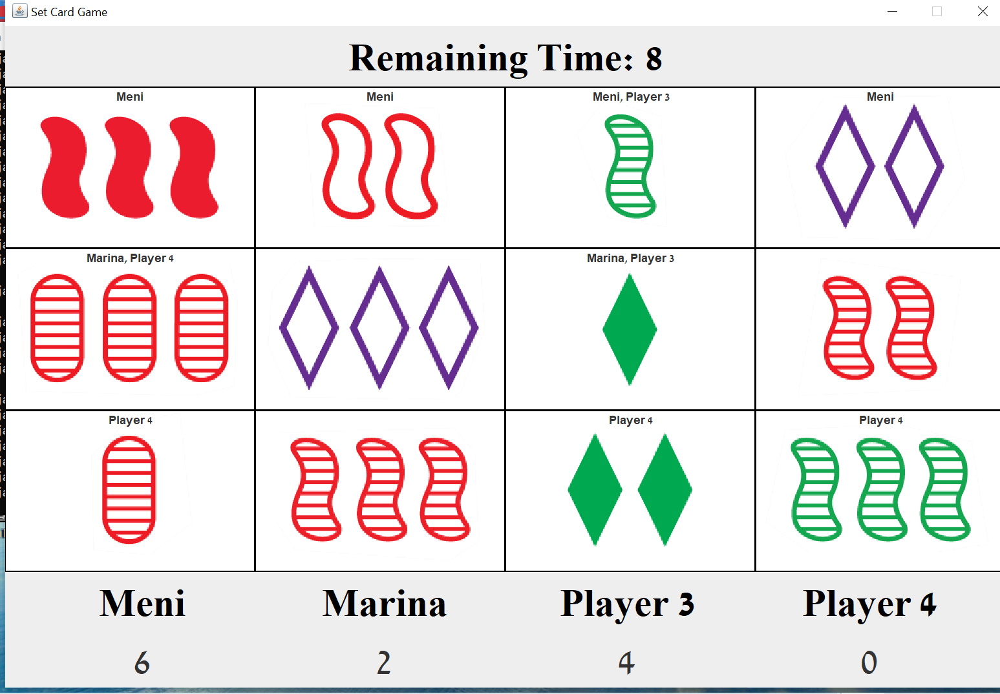

# Set_Card_Game
Set (card game), multithreaded game that supports PvP and PvE

How to play?
-There is two version available:
1. 2 Player mode PvP
2. 4 Player mode AI (spectator mode)

*download the jar file and run it via double clicking.

Doesn't work?

-> make sure you have Java and JDK installed.

-> run the file via cmd command:
1. java -jar SetGame_2Players.jar
2. java -jar SetGame_4AI_Players.jar

